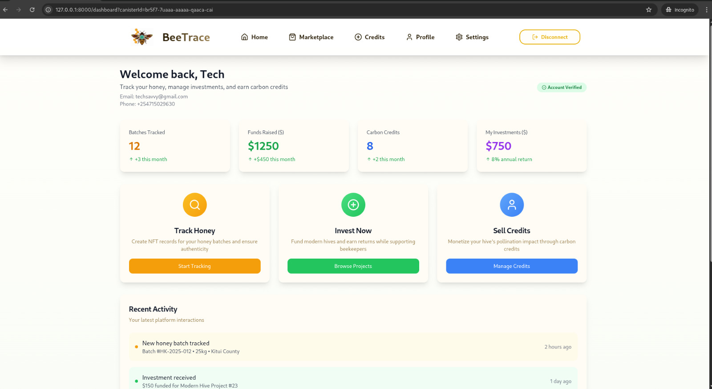
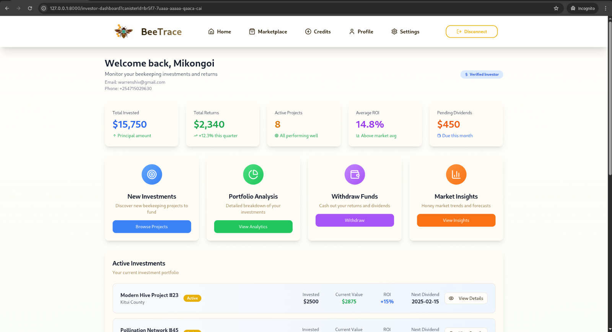

# 🐝 BeeTrace: Decentralized Honey Traceability & Beekeeping Empowerment

[](https://internetcomputer.org/)
[](https://opensource.org/licenses/MIT)


## 🌟 Project Summary

**BeeTrace** is a pioneering decentralized application (dApp) built on the Internet Computer Protocol (ICP) that aims to revolutionize Kenya's beekeeping sector. By integrating cutting-edge blockchain technology, BeeTrace provides a robust solution to combat honey adulteration through **NFT-based traceability**, addresses critical funding shortages for beekeepers via **tokenized crowdfunding for modern hives**, and unlocks new revenue streams by monetizing ecological contributions through **pollination carbon credits**. Our goal is to empower Kenyan beekeepers, increase honey yields and exports, and foster sustainable conservation practices.

## ✨ Project Overview

BeeTrace directly addresses the most pressing challenges facing the Kenyan beekeeping industry, leveraging the power of decentralized technology to create a transparent, equitable, and sustainable ecosystem.

### Problem Statement

Kenya's beekeeping sector significantly underperforms, producing only 11,000 tonnes of honey annually against a potential of 55,000 tonnes. This untapped potential is hindered by:

* **Honey Adulteration:** The widespread practice of adulterating honey with cheaper substitutes erodes consumer trust, severely limits market access, and restricts international exports, with a mere 2% of production currently reaching global markets.
* **Capital Shortages:** Over 2 million beekeepers, primarily smallholders, lack access to sufficient capital to invest in modern beehives. These modern hives significantly increase yields (20–40 kg per hive) compared to traditional methods (5–10 kg per hive), yet adoption is low due to financial constraints.
* **Unmonetized Pollination Benefits:** Bees play an indispensable role in biodiversity, agricultural productivity, and carbon sequestration. Despite their critical ecological contribution, beekeepers receive no direct financial reward for these pollination services, leading to a lack of economic incentive for conservation.

### The BeeTrace Solution

BeeTrace provides a comprehensive, blockchain-native solution to these issues, built on the Internet Computer Protocol:

* **NFT-based Honey Tracking (ICRC-7):** We ensure unparalleled transparency and authenticity throughout the honey supply chain. Each batch of honey is minted as a unique ICRC-7 NFT on the blockchain, securely storing vital data from the beekeeper, including ID, location, quality metrics (e.g., Premium, Organic), and harvest details. Consumers can scan a QR code on the product to access this immutable information, ensuring transparency, verifying authenticity, and rebuilding trust for both local and export markets.
* **$BEE Token Crowdfunding (ICRC-1):** To address capital shortages, BeeTrace facilitates a transparent crowdfunding mechanism. Beekeepers can list specific hive expansion projects, detailing their needs and projected returns. Investors, both local and international, can purchase $BEE tokens (an ICRC-1 standard token) to fund these projects, receiving a share of future honey sales as a return on investment.
* **Tokenized Carbon Credits:** We introduce a novel approach to monetize the invaluable pollination services provided by bees. By simulating and integrating data (potentially from IoT devices in the future) related to hive activity and pollination, BeeTrace mints tradable carbon credit NFTs. This innovative model creates a direct financial incentive for beekeepers to expand their operations sustainably, fostering both economic growth and environmental conservation.

By tackling these interconnected challenges, BeeTrace aims to unlock Kenya’s full beekeeping potential, significantly increase honey yields, boost lucrative export opportunities, and promote essential conservation efforts through a self-sustaining and transparent economic model.

### Key Features

* **Comprehensive Honey Traceability:**
    * **NFT Minting:** Create unique ICRC-7 NFTs for every honey batch, recording critical supply chain data.
    * **Data Integrity:** Securely store beekeeper ID, hive location, honey quality, harvest date, and quantity on-chain.
    * **Consumer Verification:** Enable real-time product verification for buyers via QR codes, fostering trust and combating adulteration.
* **Decentralized Crowdfunding Platform:**
    * **Project Listings:** Beekeepers can easily create and manage crowdfunding campaigns for new hive projects.
    * **Tokenized Investment:** Investors purchase $BEE (ICRC-1) tokens to fund projects, with transparent tracking of their contributions and expected returns.
    * **Revenue Sharing:** Implement a clear mechanism for investors to receive returns from the sales of harvested honey.
* **Pollination Credits:**
    * **Impact Tokenization:** Simulate or integrate data to quantify and tokenize the environmental impact of bee pollination.
    * **Tradable Assets:** Mint carbon credit NFTs that can be traded, providing a new revenue stream for beekeepers and incentivizing ecological stewardship.
* **Intuitive Mobile-First Interface:**
    * **Accessibility:** Designed with a responsive, intuitive mobile-first user interface to ensure ease of use for beekeepers in diverse settings.
    * **Low-Literacy Optimization:** User flows are optimized for individuals with varying levels of digital literacy, making data management and platform interaction straightforward.

### Backend Canister API

The backend, implemented in TypeScript on the Internet Computer, provides a comprehensive set of methods to manage the entire BeeTrace ecosystem:

* `createBeekeeperProfile`: Registers new beekeepers with detailed profiles.
* `createHive`: Manages the creation and properties of new beehives for crowdfunding.
* `createHoneyBatch`: Records new honey harvests, assigning quality and linking to specific hives.
* `createInvestment`: Facilitates investor contributions to hive projects.
* `createInvestorProfile`: Registers new investors on the platform.
* `getBeeKeeperProfileByOwner` (query): Retrieves a beekeeper's profile by their principal ID.
* `getBeekeeperProfile` (query): Retrieves a specific beekeeper's profile by ID.
* `getInvestorProfileByOwner` (query): Retrieves an investor's profile by their principal ID.
* `getMyHives` (query): Lists all hives associated with the authenticated beekeeper.
* `getMyInvestments` (query): Lists all investments made by the authenticated investor.
* `listBeekeepers` (query): Retrieves a list of all registered beekeepers.
* `listHives` (query): Retrieves a list of all registered hives, including crowdfunding projects.
* `listHoneyBatches` (query): Retrieves a list of all recorded honey batches.
* `listInvestments` (query): Retrieves a list of all investments on the platform.
* `listInvestors` (query): Retrieves a list of all registered investors.

### Architectural Overview

BeeTrace operates as a decentralized application (dApp) fully hosted on the Internet Computer Protocol (ICP). The architecture comprises:

1.  **Backend Canister:**
    * Developed using **TypeScript with Azle**, this canister hosts all the core business logic, including user profile management (beekeepers, investors), hive management, honey batch recording, and investment tracking.
    * It stores all application data persistently on the IC's chain-key cryptography, ensuring data integrity and availability.
    * The TypeScript code is compiled to WebAssembly (Wasm) using Azle's toolchain and deployed as an independent, scalable service.

2.  **Frontend Canister:**
    * Built with **Next.js**, providing a rich, responsive, and mobile-first user interface for all user roles.
    * The Next.js application is compiled into static assets (HTML, CSS, JavaScript) and deployed as an asset canister on the Internet Computer, ensuring true end-to-end decentralization.
    * It interacts with the backend canister using auto-generated JavaScript bindings (from Candid) to perform all read and write operations, ensuring type safety and robust communication.

This architecture ensures that both the backend logic and the frontend user interface are hosted entirely on the decentralized Internet Computer, providing end-to-end decentralization, high availability, and enhanced security.

## 🚀 Demo

### Functional Demo Video

_(Apologies.The demo video is not available for now but a link will be rpovided once ready.)_


### Demo Screenshots


_The main landing page, introduces  users to the platform_


_A glimpse of the beekeeper's dashboard, showing an overview of their hives, honey batches, and crowdfunding projects._



_The investor's view, highlighting active investment opportunities and tracking returns from honey sales._


## 🛠 Getting Started & Running the Project Locally


### Prerequisites

* **DFINITY Canister SDK:** Ensure `dfx` is installed. It's recommended to use a version like `0.28.0` or newer.
    * Install via: `sh -ci "$(curl -fsSL https://sdk.dfinity.org/install.sh)"`
* **Node.js & npm:** For both the TypeScript backend (Azle) and the Next.js frontend development. Node.js v18 or v20 (LTS versions) is highly recommended for best compatibility.

### Installation and Local Deployment

1.  **Clone the repository:**
    ```bash
    git clone https://github.com/Beetrace-Ke/bee-trace.git
    cd bee-trace/
    ```

2.  **Ensure local replica is running:**
    This command starts the Internet Computer replica in the background. The `--clean` flag is recommended for fresh deployments or to clear any old canister data from previous runs.
    ```bash
    dfx start --background --clean
    ```

3.  **Deploy your canisters using the provided script:**
    This project includes a `.deploy.sh` script in the root directory. This script automates the full deployment process for both the backend and frontend canisters. It handles installing necessary Node.js dependencies (for Azle in the root and Next.js in `src/frontend`) and deploying them to the local replica.

    ```bash
    chmod +x ./.deploy.sh
    ./.deploy.sh
    ```
    * **Note:** This script is designed to streamline your setup. If it doesn't execute correctly or you wish to perform steps manually for debugging, refer to the "Manual Deployment" section below.

    * **Expected Outcome:** After this script completes, verify that the file `src/declarations/backend/backend.did.d.ts` is correctly populated with the TypeScript interfaces for all your backend methods and data structures (e.g., `createBeekeeperProfile`, `HoneyBatch`, `Hive`, etc.), and is **not** an empty `_SERVICE {}` interface. This type generation is absolutely fundamental for the frontend to build successfully.

    ---

    **Manual Deployment (if `.deploy.sh` is not used or for debugging):**

    If for any reason you cannot use the `.deploy.sh` script, you can perform the steps manually:

    a.  **Install project-root level Node.js dependencies (for Azle):**
        ```bash
        npm install  
        ```

    b.  **Navigate to your frontend directory and install its dependencies:**
        ```bash
        cd src/frontend
        npm install 
        ```

    c.  **Build the Next.js application for deployment:**
        ```bash
        npm run build 
        ```

    d.  **Go back to project root and deploy all canisters:**
        ```bash
        dfx deploy 
        ```


    * **Troubleshooting `dfx deploy` / Type Generation:**
    
        If you encounter issues during deployment, especially with type generation (e.g., `Type error: Module '...' has no exported member 'HoneyBatch'.` or `Module not found: Can't resolve '@dfinity/agent'` when running `npm run dev`), the `backend.did.d.ts` file is likely empty or incorrect. Try these robust cleanup and redeploy steps:
        ```bash
        dfx stop
        dfx cache delete
        rm -rf src/declarations # Cleans previously generated types for ALL canisters
        dfx start --background --clean
        dfx deploy
        
        ```
        If the type generation issue persists even after these thorough steps and DFX reinstallation, it might indicate a deeper environment-specific problem (e.g., DFX version incompatibility with your OS/Node.js setup).

    ---

4.  **Run the frontend development server (for active development):**
    While `dfx deploy` (or `./.deploy.sh`) deploys a *production build* of your frontend assets, for faster development cycles with hot-reloading and direct browser access, you'll want to run the Next.js development server.

    ```bash
    cd src/frontend
    npm run dev
    ```
    Your frontend application will typically be available at `http://localhost:3000`. API requests from this development server will be automatically proxied to your local replica running on port `4943` or `8000`.

### Accessing the Application

After successful deployment, `dfx deploy` (or `./.deploy.sh`) will output the URLs for your frontend and backend canisters.

* **Frontend Application (Deployed on IC):** Open the URL provided for `frontend` in your web browser. This URL will typically look like `http://[FRONTEND_CANISTER_ID].localhost:8000/`.
* **Frontend Application (Development Server):** When running `npm run dev` in `src/frontend`, access your application at `http://localhost:3000`. This is generally preferred for active development.
* **Candid UI (Backend API):** To interact directly with the backend's API and explore its functions, use the URL provided for `backend`. This will be similar to:
    `http://127.0.0.1:8000/?canisterId=uqqxf-5h777-77774-qaaaa-cai&id=uzt4z-lp777-77774-qaabq-cai`

### Stopping the Local Replica

To stop the local Internet Computer replica and free up system resources:

```bash
dfx stop
````


## 🗺 Future Roadmap

BeeTrace is committed to continuous innovation and expansion. Our future plans include:

  * **Enhanced Traceability:** Integration with IoT sensors placed directly in beehives to provide real-time data (e.g., temperature, humidity, hive activity) for richer NFT metadata and more precise traceability.
  * **Advanced Crowdfunding Features:** Development of milestone-based funding releases for beekeepers and automated payout mechanisms for investors tied to verified honey yield targets.
  * **Deeper Carbon Credit Integration:** Exploring partnerships with established carbon registries and developing more sophisticated on-chain verification mechanisms for quantifiable pollination impact.
  * **Community Governance:** Implementation of a Decentralized Autonomous Organization (DAO) structure to enable token holders to participate in key decisions regarding platform development, fund allocation, and policy changes.
  * **Native Mobile Applications:** Development of dedicated Android and iOS mobile applications to provide an even more seamless and feature-rich experience for beekeepers and other stakeholders.

## 🧑‍💻 Team Introduction


  * **Sammy Kioko:** Project Lead, Blockchain Developer.
  * **Christopher Warren:** Smart Contract Engineer,Blockchain Developer.
  * **Christal Riziki:** Frontend Developer,UI/UX Designer.


## 📚 DFINITY Developer Resources


  * [Quick Start Guide](https://internetcomputer.org/docs/current/developer-docs/setup/deploy-locally)
  * [SDK Developer Tools](https://internetcomputer.org/docs/current/developer-docs/setup/install)
  * [Rust Canister Development Guide](https://internetcomputer.org/docs/current/developer-docs/backend/rust/) *(While your backend is TypeScript, this guide offers foundational IC development concepts and structure applicable across languages.)*
  * [Candid Introduction](https://internetcomputer.org/docs/current/developer-docs/backend/candid/)
  * [Internet Computer Specification](https://internetcomputer.org/docs/current/references/ic-interface-spec)

-----
